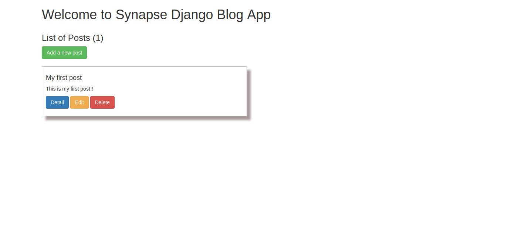

# Django SynApp

Application en django construite lors d'une démo du club synapse.

## Installation locale

- Créez un environnement virtuel avec la commande : `python3 -m venv <nom_de_votre_env>`

- Puis placez vous y : `. <nom_de_votre_env>/bin/activate` ou `source <nom_de_votre_env>/bin/activate`

- Placez-vous au niveau du projet et installez les dépendances via : `pip install -r requirements.txt`

- Puis placez-vous au niveau du repertoire `synapp` et appliquez les migrations : `./manage.py makemigrations` puis faites un `./manage.py migrate`

- Démarrez le serveur de l'application avec : `./manage.py runserver`

- Rdv à l'adresse `http://localhost:8000/blog/home`

## Installation via Docker

Si vous avez déjà `Docker` disponible sur votre machine, vous pouvez juste procéder comme suit :

- Placez vous avec votre terminal, au même niveau du fichier `Dockerfile` (ce repertoire) puis exécuter la commande suivante : `docker run --name synapse-django-app -d -p 8000:8000 synapse-django-app`

- Rdv à l'adresse `http://localhost:8000/blog/home`

## Screenshot

